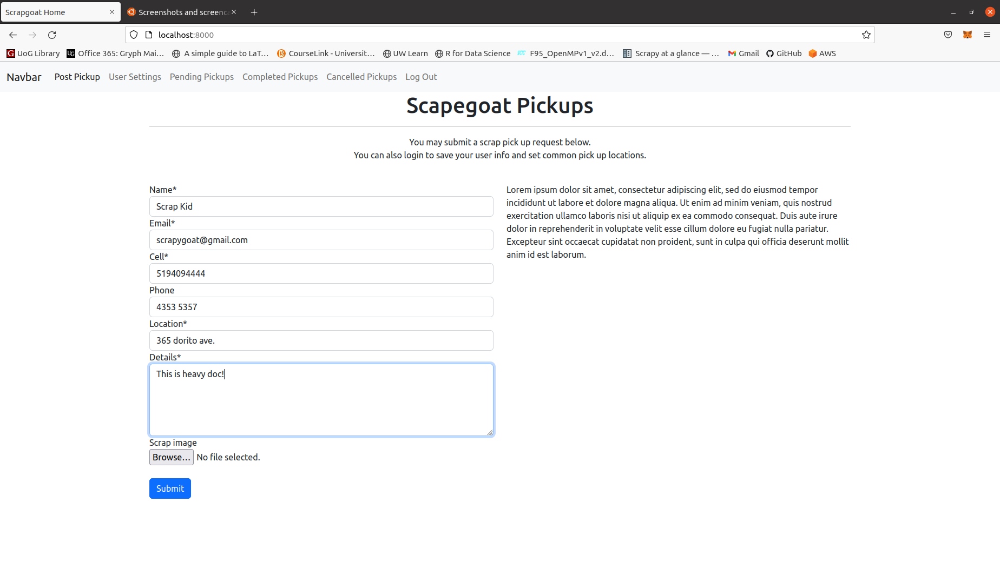

# django-scrapgoat
Web App for Scrapgoat on django.
Scrapgoat is a local charity service in Guelph, ON 
that collects scrap metal and e-waste to sell.
All profit goes to local charities.

This app will allow users to submit pickup requests and moderators to
view and mark complete or cancelled.

Example of Posting Pickup main page 
